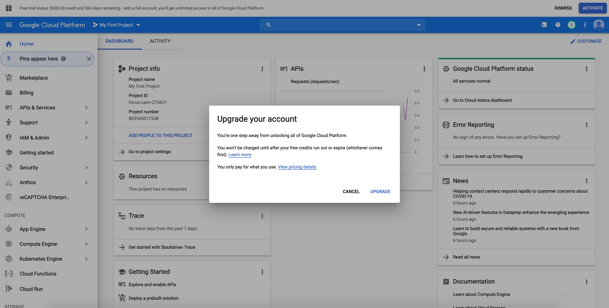

# Get started with Google Cloud Platform

## Reminder: STOP YOUR INSTANCES

We've put this reminder at the beginning to both emphasize the importance and to remind users first thing when they open the guide.

You will use instances such as TPUs and VMs a lot on Google Cloud Platform. These instances are expensive and will cost a large amount of money if you don't shut them down in time.

_**Stopping instances** is very important and can be done by clicking on the stop button at the top of the page showing your instances._ Otherwise, you **will run out of credits**. More details about this below.

## Overview

This section explains the advantages of using Google Cloud Platform (GCP) and introduces essential elements you will use. Information about how to shut down expensive components is also included.

### Colab vs. GCP

Colab is a helpful and free tool for both assignments and experimentation for your project, while on GCP you can choose a dedicated GPU instance when you start training on large datasets and collaborate as a team more easily:

* Colab will automatically disconnect after 12 hours or ~30 min of idling (and you will lose your unsaved data). GCP Virtual Machine instances will not disconnect until you stop it (or run out of credits).

* Using Colab, you will have to save all your data and models to Google Drive. GCP Virtual Machine instances have large disk space which allows you to deal with larger datasets.

* Colab does not innately support real-time collaboration.

* On GCP, You can choose GPU types (eg. NVIDIA Tesla k80, NVIDIA Tesla P4, etc.) and can use multiple GPUs for distributed training.

A better practice to use both resources efficiently is to use Colab to ensure that the model is converging before spinning up the GCP resources.

### Key elements of GCP

There are 3 key elements in GCP to run a machine learning (ML) model: bucket, virtual machine (VM), and TPU.

#### Bucket

A [bucket](https://cloud.google.com/storage/docs/key-terms#buckets) is a stable storage space to store data.

#### Virtual Machine (VM)

A [VM](https://cloud.google.com/compute/docs/instances) is an **expensive** operating system. We run machine learning programs on our VMs. VMs can read data from buckets to build a machine learning model. We can store the results of our model to buckets.

#### TPU

[TPU](https://cloud.google.com/tpu/docs) is also **expensive**. When we run machine learning programs on VMs, the programs use TPU(s) to accelerate computation.

### Shut down expensive elements!

As mentioned, VMs and TPUs are expensive. So we should **<span style="color:red">shut down</span>** TPUs and VMs when we're not using them.
*   We can shut them down using command lines or through web interfaces manually. However, we might forget to do so, and result in unnecessary spending.
*   We also provide instructions on shutting them down automatically by [a script below](#automatic-shutdown).

## Create and configure account

This section contains detailed procedures to create a GCP account and configuring projects. Upgrading accounts and adding people to projects for collaboration are also mentioned.

### Create your first GCP account

A GCP account grants you access to all Cloud Platform Products. When you sign up on GCP and upgrade to a full account, you should receive $300 credits from Google over the next 12 months. Please use the resources judiciously.

1. Create Google Cloud account by going to the [Google Cloud homepage](https://cloud.google.com/?utm_source=google&utm_medium=cpc&utm_campaign=2015-q2-cloud-na-gcp-skws-freetrial-en&gclid=CP2e4PPpiNMCFU9bfgodGHsA1A "Title"). Click on the blue **Get Started for Free** button. Sign in to your Gmail account.


2. Select **Account type** to be **Individual**. You will then fill in your name, address, and credit card information.


3. Click the **Google Cloud Platform**, and it will take you to the main project dashboard.


### Configure Your Project 

1. On the main project dashboard, you can change the name of your project by clicking **Go to project settings**.


2. To add project collaborators, click **ADD PEOPLE TO THIS PROJECT**. Add their email and make their role owners.


3. **Upgrade your account** to use GPUs by following these [instructions](https://cloud.google.com/free/docs/gcp-free-tier#how-to-upgrade). Otherwise, [Google Cloud Free Tier](https://cloud.google.com/free/docs/gcp-free-tier#how-to-upgrade) does not come with GPU support or quota.




## Walk through a sample project

Based on [Training transformer on Cloud TPU (TF 2.x)](https://cloud.google.com/tpu/docs/tutorials/transformer-2.x), we provide the following instructions. We are going to:

* Create VM, bucket, and TPU instance.
* Run an ML program (training transformer) on VM, accelerated by TPU, and store results to buckets.
* Shut down TPU and VM automatically.

### Creating a VM

#### Open a cloud shell window

From [here](https://console.cloud.google.com/?cloudshell=true&_ga=2.130633615.148565199.1589727540-1957719261.1589398391), you can open a cloud shell window and view the cloud console page at the same time.

#### Create a variable for your project's name

In the bash commands, please change `project-name` to the project ID displayed in the up left side of the console page.

```bash
export PROJECT_NAME=project-name
gcloud config set project ${PROJECT_NAME}
```

#### Create your own VM

You can use the following command to create a VM instance named transformer-tutorial in Cloud Shell.


```bash
ctpu up --vm-only \
 --disk-size-gb=300 \
 --machine-type=n1-standard-8 \
 --zone=us-central1-b \
 --tf-version=nightly \
 --name=transformer-tutorial
```

Enter `y` to approve the creation of VM.

Enter `y` to approve the creation of VM.

Please pay attention to `--zone`. Select a zone that is not used by too many people:

- You can see what zones are used by other people by the following navigation: Console page -> Compute Engine -> “TPUs” in the left sidebar -> zones.

- You can see the set of zone names by the following navigation: Console page -> Compute Engine -> “Zones” in the left sidebar. Pick up a name from here.

Please remember the zone information in the above command `us-central1-b`. It will be used later when we create TPU.

Now the VM is created and started. **The start of the VM triggers the start of charging fees, until the VM is shutdown**.

Then use the following command to access the VM.

```bash
gcloud compute ssh transformer-tutorial --zone=us-central1-b
```

It will ask you to create a rsa key pair for yourself. Just create one.

### Access your newly created VM 

Now that you have created your Virtual Machine using Cloud Shell, you may also want to connect to it from your computer.

### Install gcloud command-line tools
To access [gcloud commands](https://cloud.google.com/sdk/gcloud/reference) in your local terminal, follow the instructions to install [Google Cloud SDK](https://cloud.google.com/sdk/docs). 

If the `gcloud` command is not in your system path after installation, you can also reference it by its full path `/<DIRECTORY-WHERE-GOOGLE-CLOUD-IS-INSTALLED>/bin/gcloud`. See [this page](https://cloud.google.com/compute/docs/instances/connecting-to-instance "Title") for more detailed instructions.

To ssh into your VM, go to your VM instance details page by clicking on its name. Start the VM instance first. Once it has a green checkmark on, click on the drop-down arrow and select `View gcloud command` instead to retrieve the terminal command. It should look like

```bash
gcloud compute ssh --project <YOUR_PROJECT_ID> --zone <YOUR_ZONE> <YOUR_VM_NAME>
```

### Verification

If you have GPU enabled, you should be able to:

* run `nvidia-smi` and see the list of attached GPUs and their usage statistics. Run `watch nvidia-smi` to monitor your GPU usage in real-time.
* inside the `gcloud/` folder, run `python verify_gpu.py`. If your GPU is attached and CUDA is correctly installed, you shouldn't see any error.
* If you want to use Tensorflow 2.1, run `python test_tf.py`. The script will show you the installed Tensorflow version (2.1.0) and then run a sample MNIST training. You should see around 97% accuracy at the end.

### Using Jupyter Notebook with Google Compute Engine 
You can use Jupyter Notebook to experiment for your projects. In this section, we discuss how to run Jupyter Notebook from your GCE instance and connect to it with your local browser.

After you ssh into your VM, run Jupyter notebook from the folder with your project files.

```
jupyter notebook
```

The default port is `8888`, specified in `~/.jupyter/jupyter_notebook_config.py`.

You can connect to your Jupyter Notebook session from your laptop. Check the external IP address of your instance, say it is `35.185.240.182`. Open any browser and visit `35.185.240.182:8888`. The login password is the one you set with the setup script above.

### Creating a bucket

In the following command, please specify your  `bucket-name`

```bash
gsutil mb -p ${PROJECT_NAME} -c standard -l zone=us-central1 -b on gs://bucket-name
```

### Generate training dataset

#### Variables and directory

For the following command, please specify your  `bucket-name` that you just used.


```bash
export STORAGE_BUCKET=gs://bucket-name
export PARAM_SET=big
export GCS_DATA_DIR=$STORAGE_BUCKET/transformer/data
export MODEL_DIR=$STORAGE_BUCKET/transformer/model_$PARAM_SET
export PYTHONPATH=:/usr/share/models
export DATA_DIR=${HOME}/transformer/data
export VOCAB_FILE=${DATA_DIR}/vocab.ende.32768
```

#### Download and prepare the datasets

Download and process data in VM.

```bash
cd /usr/share/models/official/nlp/transformer
python3 data_download.py --data_dir=${DATA_DIR}
```

Move processed data from VM to bucket.

```bash
gsutil cp -r ${DATA_DIR} ${GCS_DATA_DIR}
```

A tutorial of using `gsutil` is [here](https://cloud.google.com/storage/docs/quickstart-gsutil)

We are using the codes pre-loaded into the VM, since they are already under `/usr/share/models/official/nlp/transformer`.


If we want to import outside codes into VM in the future (we don't have to do it now), here are some options:
*   [Upload files to VM](https://cloud.google.com/compute/docs/instances/transfer-files)
*   Use `git clone` to clone a Github repository
*   Upload codes from local drive to bucket. Then copy codes from bucket to VM


### Create TPU


```bash
ctpu up --tpu-only \
  --tpu-size=v3-8  \
  --zone=us-central1-b \
  --tf-version=nightly
```


**Zone here should be the same as what you have set [at VM creation](#vm-zone)**.

After executing the command, the TPU name will be the same as your VM’s name. Let’s also set it as an environmental variable.


```bash
export TPU_NAME=transformer-tutorial
```

### Run the training script

By the following command, the program in VM will read data from bucket to build and train the transformer model. Then the model results/checkpoints will be stored into bucket.

```bash
python3 transformer_main.py \
    --tpu=${TPU_NAME} \
    --model_dir=${MODEL_DIR} \
    --data_dir=${GCS_DATA_DIR} \
    --vocab_file=${GCS_DATA_DIR}/vocab.ende.32768 \
    --bleu_source=${GCS_DATA_DIR}/newstest2014.en \
    --bleu_ref=${GCS_DATA_DIR}/newstest2014.de \
    --batch_size=6144 \
    --train_steps=2000 \
    --static_batch=true \
    --use_ctl=true \
    --param_set=big \
    --max_length=64 \
    --decode_batch_size=32 \
    --decode_max_length=97 \
    --padded_decode=true \
    --distribution_strategy=tpu
```

Using the above command, we occupy one terminal in VM to run the Python program. However, it is better to let the program run at the backend of the VM, so you don’t need to maintain the SSH connection to VM all the time. The results can be printed in the log, or stored into VM or GCS buckets. 

[Later](#automatic-shutdown), we will explain how to combine Python and shutdown commands at the backend to achieve automatic shutdown.

### Manual shutdown of TPU and VM

#### By commands

Then you can shut down TPU and VM manually by the following commands or by the web interface.

```bash
ctpu pause --name=transformer-tutorial --zone=us-central1-b
gcloud compute instances stop transformer-tutorial --zone=us-central1-b
```

#### By web interface

You can also shut down TPU and VM using the web console interface:

- Shut down **TPU** by this navigation: Console page -> Compute Engine -> “TPUs” in the left sidebar, you can select "transformer-tutorial" and click "STOP". You should wait for around 3 minutes to make sure that "transformer-tutorial" **disappears** from this page.

- Shut down **VM** by this navigation: Console page -> Compute Engine -> “VM instances” in the left sidebar, you can select "transformer-tutorial" and click "STOP". You should wait for around 2 minutes to make sure that the status of "transformer-tutorial" becomes **grey** on this page.

### Automatic shutdown

It’s better to let the model run at the backend of the VM, so you don’t need to maintain the connection to VM all the time.

The results can be printed in the log, or stored into VM or GCP buckets.

What we are doing here is to put all commands we mentioned into a [bash script](https://www.cyberciti.biz/faq/how-to-execute-a-shell-script-in-linux/): demo.sh

```bash
#!/bin/bash
echo "Hello $USER"
# specify TPU name
export TPU_NAME=transformer-tutorial

# specify paths
export STORAGE_BUCKET=gs://bucket-name
export PARAM_SET=big
export GCS_DATA_DIR=$STORAGE_BUCKET/transformer/data
export MODEL_DIR=$STORAGE_BUCKET/transformer/model_$PARAM_SET
export PYTHONPATH=:/usr/share/models
export DATA_DIR=${HOME}/transformer/data
export VOCAB_FILE=${DATA_DIR}/vocab.ende.32768
cd /usr/share/models/official/nlp/transformer

echo "Python started!"
echo "at $(date)"

python3 data_download.py --data_dir=${DATA_DIR}
python3 transformer_main.py --tpu=${TPU_NAME} \
														--model_dir=${MODEL_DIR} \ 
														--data_dir=${GCS_DATA_DIR} \
														--vocab_file=${GCS_DATA_DIR}/vocab.ende.32768 \
														--bleu_source=${GCS_DATA_DIR}/newstest2014.en \
														--bleu_ref=${GCS_DATA_DIR}/newstest2014.de  \
														--batch_size=6144  --train_steps=2000 \
														--static_batch=true \
														--use_ctl=true  \
														--param_set=big \
														--max_length=64 \
														--decode_batch_size=32 \
														--decode_max_length=97 \
														--padded_decode=true \
														--distribution_strategy=tpu &> ~/transformer_main.log

echo "Python finished!"
echo "at $(date)"

# shut down TPU first and then VM
ctpu pause --name=transformer-tutorial --zone=us-central1-b
gcloud compute instances stop transformer-tutorial --zone=us-central1-b
```

After editing the demo.sh, we go back to the cloud shell and execute the following command. Then the program will start to run at the backend of VM. Then it will shut down TPU and VM after the program is finished.

```bash
printf 'y\n' | nohup ./demo.sh &> ~/demo.log &
```
Now you have shut down TPU and VM. Your VM is not deleted. You can start your VM in the future to see your script and Python log in your root directory.

### Start VM and TPU the next time

You can use the following command to restart your VM and TPU.

TPU:

```bash
ctpu up --zone=us-central1-b --tf-version=nightly --name=transformer-tutorial --tpu-size=v3-128  --project=cloud-tpu-colab-integration --tpu-only
```
VM:

```bash
gcloud compute instances start transformer-tutorial --zone=us-central1-b
```

After you start your VM, you can use SSH to login/access your VM.

Login VM:

```bash
gcloud auth login
INSTANCE=transformer-tutorial
gcloud compute ssh --project=cloud-tpu-colab-integration --zone=us-central1-b $INSTANCE
```
Now you are in your root directory again!

## Other Tips
You can use [Tmux](https://linuxize.com/post/getting-started-with-tmux/) to keep the training sessions running when you close your laptop. Also, if your collaborators log into the same account on the VM instance, they will see the same tmux session screen in real-time. 

You can develop your code on the remote server directly if you are comfortable with vim or emacs.

You can develop locally on your favorite editor, push to your branch on Github, and pull on the remote server to run.

Besides `gcloud compute scp`, another tool you can check out is [rsync](https://linuxize.com/post/how-to-use-rsync-for-local-and-remote-data-transfer-and-synchronization/) which can synchronize files and folders between your local machine and the remote server.

## REMINDER: Make sure you stop your instances!

Don't forget to stop your instance when you are done (by clicking on the stop button at the top of the page showing your instances, or by the [other methods](#automatic-shutdown) listed above). You can restart your instance and the downloaded software will still be available.

You will be charged per hour when your instance is running. This includes code development time. We encourage you to read up on Google Cloud and regularly keep track of your credits.
